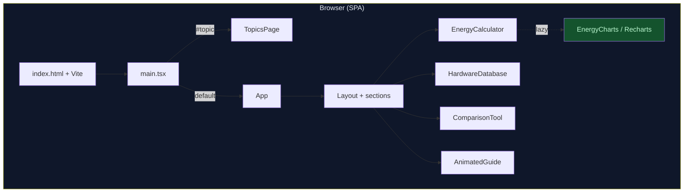
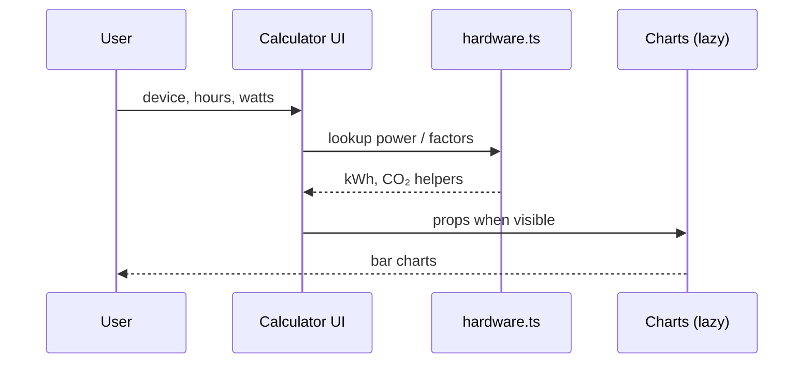

<div align="center">


<br/>

[](https://vitejs.dev/)
[](https://react.dev/)
[](https://www.typescriptlang.org/)
[](https://tailwindcss.com/)

<br/>

**Client-side sustainability analytics — estimate power & emissions, compare hardware, explore green IT theory.**

<sub>Zero backend · Privacy-friendly local math · OLED-oriented dark UI</sub>

</div>

---

## Table of contents

| | Section |
|---|--------|
| 1 | [Overview](#-overview) |
| 2 | [Feature matrix](#-feature-matrix) |
| 3 | [Architecture](#-architecture) |
| 4 | [Quick start](#-quick-start) |
| 5 | [Makefile & scripts](#-makefile--scripts) |
| 6 | [Project structure](#-project-structure) |
| 7 | [Theory view](#-theory-view) |
| 8 | [Build & deploy](#-build--deploy) |
| 9 | [Tech stack](#-tech-stack) |

---

## Overview

<table>
<tr>
<td width="50%" valign="top">

### What it does

- **Energy & CO₂ calculator** — Pick device category and model, set hours/day and watts; see daily/monthly **kWh**, **kg CO₂**, and rough equivalents.
- **Hardware database** — Filter CPUs, GPUs, laptops, desktops, and phones; track **efficiency** signals.
- **Comparison tool** — Shortlist up to three devices and highlight the lower-emissions choice.
- **Case studies** — Curated notes on how hyperscalers approach efficiency (read-only content).
- **Scroll-synced guide** — A lightweight animated companion + **cloud** speech bubble with section-aware hints.

</td>
<td width="50%" valign="top">

### UX & presentation

| Aspect | Detail |
|--------|--------|
| **Theme** | Black / slate base, emerald & cyan accents |
| **Motion** | Framer Motion for hero, cards, and guide |
| **Charts** | Recharts (lazy-loaded from calculator section) |
| **Icons / brand** | SVG logo in `public/logo.svg` |

</td>
</tr>
</table>

---

## Feature matrix

<div align="center">

| Area | Capability | Notes |
|:--|:--|:--|
| **Calculator** | kWh, CO₂, score bar, tips | Uses shared hardware dataset |
| **Database** | Search & category filters | Apple + Android phones included |
| **Compare** | 2–3 device emissions | Tied to calculator DB |
| **Theory** | `#topic` hash route | Separate view, opens in new tab from header |
| **Accessibility** | `aria-live` on guide, semantic sections | Improvable over time |

</div>

---

## Architecture

> Renders entirely in the browser. No API keys, no telemetry in the template.



<details>
<summary><strong>Expand — data flow (calculator)</strong></summary>



</details>

---

## Quick start

<details open>
<summary><strong>Recommended — Make</strong></summary>

```bash
git clone https://github.com/29pakhilesh/green-computing-dashboard
cd EVS
make install
make dev
```

Then open the URL Vite prints (typically **`http://localhost:5173`**).

</details>

<details>
<summary><strong>Alternative — npm only</strong></summary>

```bash
npm install
npm run dev
```

</details>

### Requirements

| Tool | Version |
|------|---------|
| **Node.js** | ≥ 18 |
| **npm** | ≥ 9 (or compatible) |

---

## Makefile & scripts

<div align="center">

| `make …` | npm equivalent | Purpose |
|:--|:--|:--|
| `make` / `make help` | — | Show all targets |
| `make install` | `npm install` | Dependencies |
| `make dev` | `npm run dev` | Dev server + HMR |
| `make build` | `npm run build` | Output to `dist/` |
| `make preview` | `npm run preview` | Serve production build |
| `make lint` | `npm run lint` | ESLint on `src/` |
| `make clean` | — | Remove `dist/` |

</div>

> **Note:** ESLint 9 expects an `eslint.config.*` file. If `make lint` fails, add a flat config or run `npm run lint` after configuring ESLint for your team.

---

## Project structure

<details>
<summary><strong>Tree (high level)</strong></summary>

```
EVS/
├── assets/
│   └── readme-banner.svg      # README hero art
├── public/
│   └── logo.svg
├── src/
│   ├── components/            # UI modules (Layout, charts, guide, …)
│   ├── data/
│   │   └── hardware.ts        # Device records & math helpers
│   ├── App.tsx
│   ├── TopicsPage.tsx         # Theory / concepts
│   ├── main.tsx               # Entry + #topic switch
│   └── index.css              # Tailwind + globals
├── index.html
├── vite.config.ts
├── tailwind.config.cjs
├── postcss.config.cjs
├── tsconfig.json
├── Makefile
├── package.json
└── README.md
```

</details>

---

## Theory view

Open the **Theory View** control in the header (or append **`#topic`** to the URL) to read green computing topics in a dedicated layout. From that page, **Dashboard** returns focus to the opener tab when launched via `window.open`.

---

## Build & deploy

```bash
make build
# → static files in dist/
```

Serve `dist/` with any static host (Netlify, Vercel, S3, nginx, etc.). No server-side runtime required.

---

## Tech stack

<div align="center">

| Layer | Packages |
|:--|:--|
| **Bundler** | Vite 6, `@vitejs/plugin-react-swc` |
| **UI** | React 18, Tailwind 3, Framer Motion |
| **Charts** | Recharts |
| **Types** | TypeScript 5 |

</div>

---

<div align="center">

---

**Smart Green Computing Dashboard** · *Measure smarter. Emit less.*

<sub>README banner: <code>assets/readme-banner.svg</code> · Built with Vite + React</sub>

</div>
